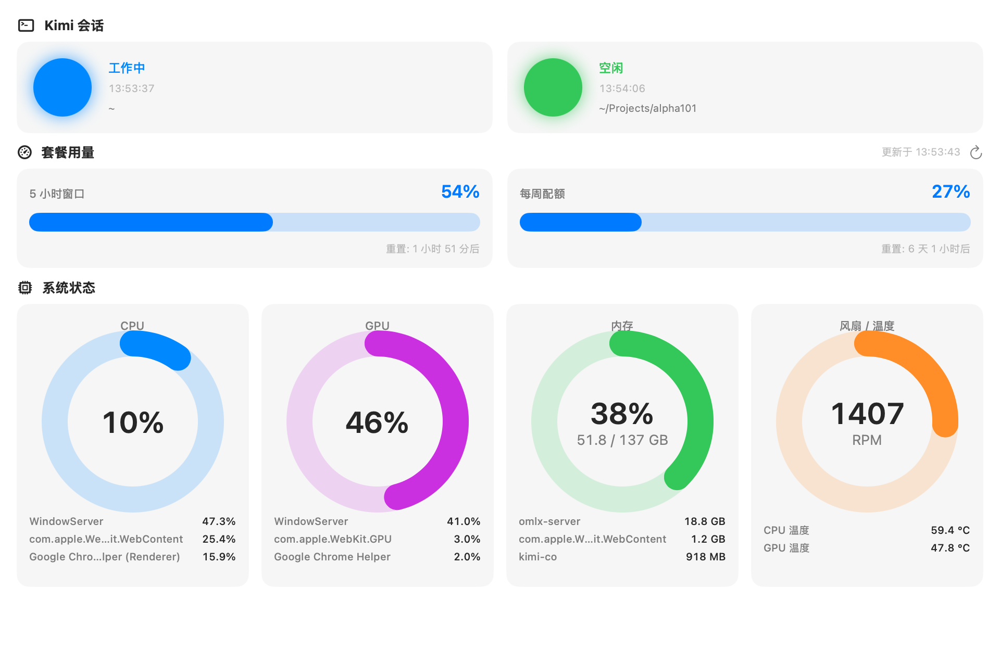

# kimi_monitor

macOS 原生 app，实时监控本机所有 Kimi Code CLI 会话的工作状态，同时展示套餐用量和系统资源。主窗口 + 菜单栏图标，面板化设计，方便扩展。



## 界面

单页仪表盘（无侧栏，窗口可自由缩放），从上到下三个 section：

### Kimi 会话

每个 session 一个瓦片（双列弹性栅格，与套餐用量卡片同宽），内容：状态灯、状态描述、最后更新时间、工作目录。

| 状态 | 颜色 | 触发事件 |
| --- | --- | --- |
| 🔵 工作中 | 蓝 | `TurnStarted` / `UserPromptSubmit` / `UserPromptQueued` / `PermissionResult` |
| 🟠 等待用户 | 橙（呼吸灯动画） | `PermissionRequest` / `PreToolUse: AskUserQuestion` |
| 🟢 空闲 | 绿 | `Stop` / `StopFailure` / `Interrupt` / `SessionStart` |

- "等待用户"是呼吸灯效果（0.9s 周期缩放 + 透明度脉动），一眼定位在等你的会话
- kimi 每 60 秒发一次 `SessionHeartbeat`；**150 秒无心跳视为死会话**，自动从列表移除并清理状态文件（正常退出走 `SessionEnd` 立即移除）
- 右键瓦片：在 Finder 中打开工作目录 / 复制 Session ID；悬停显示完整会话标题

### 套餐用量

- **5 小时滚动窗口** 和 **每周配额** 各一张卡片：大号百分比（>70% 橙、>90% 红）+ 18pt 进度条 + 重置倒计时
- 右上角手动刷新按钮 + 最后更新时间

### 系统状态

CPU / GPU / 内存 / 风扇&温度四个环形仪表（线宽固定 25pt，圆环直径 150pt），CPU/GPU/内存瓦片下方实时显示**该资源占用 Top 3 的进程及用量**（2 秒刷新）：

- CPU：Mach `host_processor_info` tick 差分；进程 Top3 来自 `ps -r`；环中心下方小字显示**当前时钟频率**（IOReport 性能状态驻留加权，取最快集群）
- GPU：IOKit `IOAccelerator` PerformanceStatistics（Apple Silicon，免 sudo）；进程 Top3 遍历 `AGXAccelerator` 下的 `AGXDeviceUserClient`，按 `accumulatedGPUTime` 差分后归一化分摊到系统总利用率（与 mactop 同口径）；环中心下方小字显示 GPU 频率（`GPUPH` 通道加权）
- 内存：`host_statistics64`，active + wired + compressed，环中心显示百分比 + `已用/总量 GB`；进程 Top3 用 `proc_pid_rusage` 的 **phys_footprint**（与活动监视器同口径，无权限进程回退 RSS）
- 风扇 / 温度：SMC 直读（AppleSMC，免 sudo）。环 = 全部风扇平均 RPM / 5500；下方显示 CPU 温度（`TCMb` Die 传感器）和 GPU 温度（`Tg*` 组最热键，启动时探测后缓存）；无风扇机型显示"无风扇"

### 菜单栏

图标聚合显示最需要关注的状态 + 会话数（如 `🟠 2`）；下拉菜单列出各会话状态，第一项"打开主窗口"。

## 数据来源与架构

```
Kimi CLI ──hook事件(stdin JSON)──▶ report_status.py ──原子写入──▶ ~/.kimi-code/status/<session_id>.json
                                                                          ▲
KimiMonitor.app ──SessionMonitor 每 1s 轮询───────────────────────────────┘
云端 API ──GET {apiBase}/usages (Bearer token)──▶ QuotaMonitor 每 60s 刷新
Mach / IOKit ──────────────────────────────────▶ SystemMonitor 每 2s 采样
```

- **用量 token** 来自 `~/.kimi-code/credentials/kimi-code.json`（与 CLI 共享，只读 + 原子写回）。access_token 约 15 分钟过期，app 自动用 refresh_token 调 `{oauthHost}/api/oauth/token` 刷新；region 由 `~/.kimi-code/region` 决定（`cn`→kimi.com，其他→kimi.ai）。与 CLI 并发刷新偶发失败会在下一轮自愈。
- **扩展**：新增面板 = 加一个 `Monitor`（ObservableObject 单例）+ 一个 Section View，并在 `MainView` 里挂上。

## 使用

```bash
./install.sh          # 安装 hook 到 ~/.kimi-code/hooks/ 并追加 config.toml 规则（幂等）
./build.sh            # swiftc 编译打包为 KimiMonitor.app（需 Xcode CLT，macOS 13+）
open KimiMonitor.app
```

安装 hook 后需**重启 kimi 会话**让配置生效。开机自启：系统设置 → 通用 → 登录项中添加 `KimiMonitor.app`。

## 文件结构

```
hooks/report_status.py        # 状态上报 hook（事件→状态映射，含 AskUserQuestion 特判）
app/KimiMonitorApp.swift      # @main 入口：WindowGroup + 注入各 monitor
app/AppDelegate.swift         # 菜单栏 status item（聚合适配 + 下拉菜单）
app/Models.swift              # 数据模型（SessionState / UsageResponse）与共享 helper
app/Monitors/
  SessionMonitor.swift        # 轮询状态目录，死会话剔除
  QuotaMonitor.swift          # OAuth token 刷新 + /usages 拉取
  SystemMonitor.swift         # CPU / GPU / 内存 / SMC 传感器采样
  SMC.swift                   # AppleSMC 读取（风扇 RPM / 温度键枚举）
app/Views/
  MainView.swift              # 单页骨架（ScrollView + 三个 Section）
  SessionsView.swift          # 会话瓦片（呼吸灯）
  QuotaView.swift             # 配额卡片
  SystemView.swift            # 环形仪表
build.sh / install.sh
```
